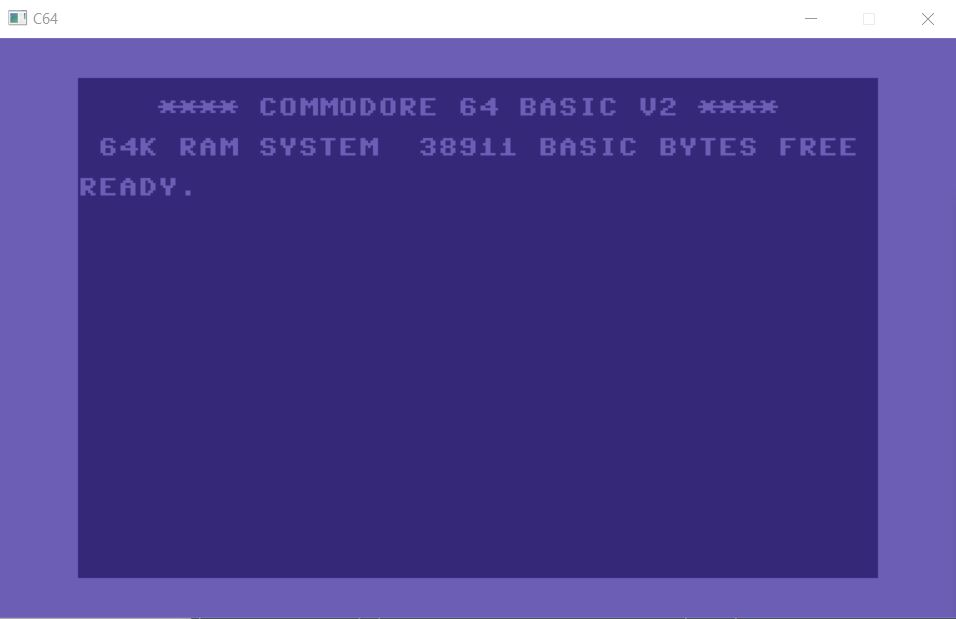
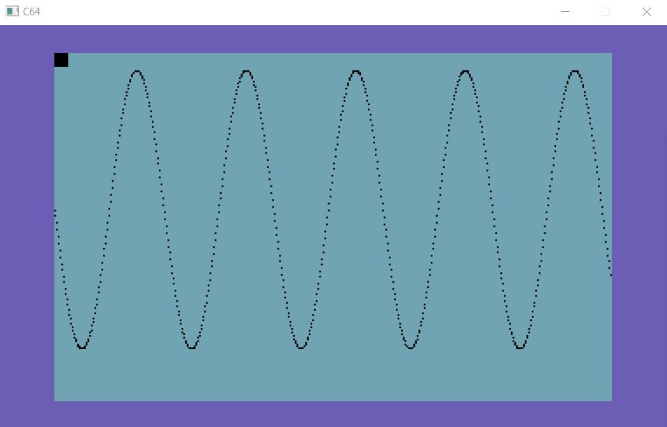
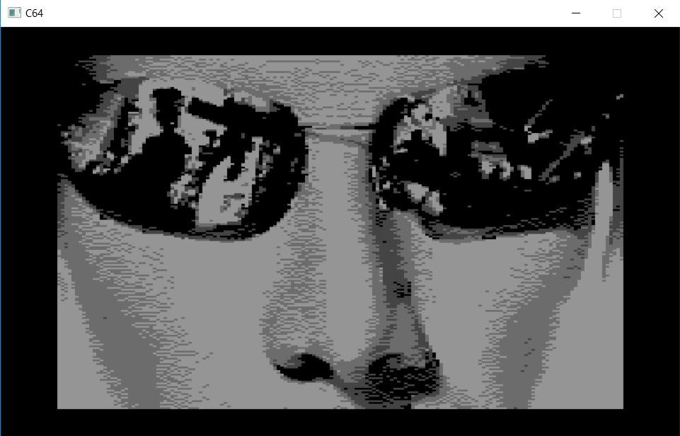

# retroc64 - Commodore 64 Emulator in Rust

## Overview

retroc64 is a Commodore 64 emulator written in Rust.

## Why?

Everyone should write at least one emulator.

Especially in Rust.

## Features

* Boots up and runs BASIC
* Emulates several VIC modes including multi-color graphics
* Emulates basic sprite rendering
* Can load PRG files
* Built in monitor and debugger
* C64 keyboard (positional)

Example screen shots:







## Not Yet Implemented

The list of things not yet implemented is huge and too long to list.
No SID support, only approximate cycle accuracy, very little to no I/O, etc etc.

## Building

1. You need to have Rust installed - see the [Rust Web Site](https://www.rust-lang.org/index.html) for latest info on installing Rust.

2. You will also need to have appropriate SDL libraries for your platform.

3. You can build the application with:
```
cargo build
```

## Usage

The basic usage and options are outlined below (also available with the --help flag).

```
retroc64 0.1.0
Salim Alam
Commodore 64 Emulator

USAGE:
    retroc64.exe [FLAGS] [OPTIONS]

FLAGS:
    -d, --debug      Debug the emulator in monitor mode
    -h, --help       Prints help information
    -V, --version    Prints version information

OPTIONS:
    -s, --start_addr <ADDRESS>    Start address for Program Counter (hexadecimal) (default: FCE2)
```

Please make sure that the required Commodore 64 ROMs are present in the `roms` directory. See the `README` in that directory for more information.

## Using the Monitor

The monitor is entered when the `Escape` key is hit.

Once in monitor mode, you can enter a "?" to get the list of commands:

```
Commands:
(s)tep        - execute next instruction (single step)
(g)o          - execute till next breakpoint
(r)eg         - dump registers
(m)em [addr]  - dump memory at addr
(p)c [addr]   - set the PC to addr
(b)p [addr]   - set breakpoint at addr
(l)oad [file] - load a PRG file
e(x)it        - exit program
```

## Author(s)

Salim Alam

## License

Source code is released under the Apache 2.0 license as follows:

Copyright 2018 Salim Alam

Licensed under the Apache License, Version 2.0 (the "License");
you may not use this file except in compliance with the License.
You may obtain a copy of the License at

    http://www.apache.org/licenses/LICENSE-2.0

Unless required by applicable law or agreed to in writing, software
distributed under the License is distributed on an "AS IS" BASIS,
WITHOUT WARRANTIES OR CONDITIONS OF ANY KIND, either express or implied.
See the License for the specific language governing permissions and
limitations under the License.
